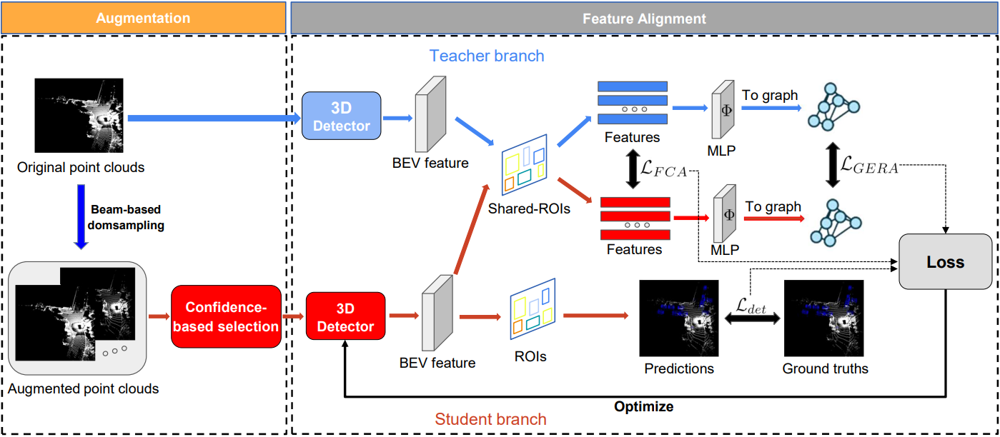
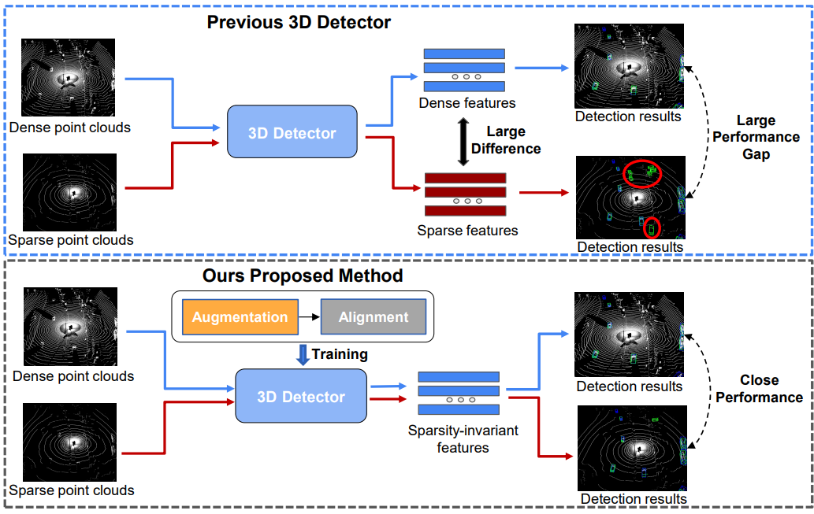

# Improving Generalization Ability for 3D Object Detection by Learning Sparsity-invariant Features 
The following figure is the overall structure of our method.

## Introduction
In this paper, we propose a training method to improve the generalization ability for 3D object detection on a single domain. Our method empowers the 3D detector to learn sparsity-invariant features through training with our proposed augmentation and feature alignment techniques.

## Pretrained Models
### Waymo General
We provide SECOND-IoU and PV-RCNN models trained in Waymo dataset using our method in the following table.
|                                                                                                                                                                  |   Waymo   | ->nuScenes | ->KITTI  |   Avg.  | 
|------------------------------------------------------------------------------------------------------------------------------------------------------------------|:---------:|:----------:|:--------:|:-------:|
| [SECOND-IoU](tools/cfgs/waymo_general/secondiou/secondiou.yaml) [[model](https://drive.google.com/file/d/1k8Ff0dl28xtVkXv5n0iZOfZQ7qhBTzdG/view?usp=drive_link)] |   51.27   |    22.30   |   53.60  |  42.39  |
| [PV-RCNN](tools/cfgs/waymo_general/pvrcnn/pvrcnn.yaml) [[model](https://drive.google.com/file/d/1XqLp6xiujvmcVBSGOP52JoqyxxyEe9M5/view?usp=drive_link)]          |   56.03   |    25.83   |   48.25  |  43.37  |

You can also download all the pretrained models in the following [link](https://drive.google.com/file/d/1dE-uBtGcD8EpoYxd1vOCFe6WC1GaIm3x/view?usp=drive_link). The zip file includes all the models used in the experiments section.

## Installation

Please refer to [INSTALL.md](docs/INSTALL.md).

## Getting Started

Please refer to [GETTING_STARTED.md](docs/GETTING_STARTED.md).

## License

Our code is released under the Apache 2.0 license.

## Acknowledgement

Our code is heavily based on [OpenPCDet v0.2](https://github.com/open-mmlab/OpenPCDet/tree/v0.2.0) and [ST3D](https://github.com/CVMI-Lab/ST3D). Thanks OpenPCDet Development Team for their awesome codebase.
